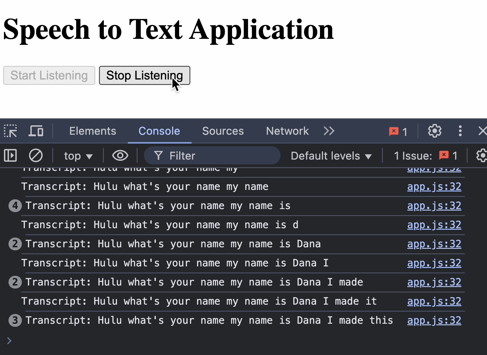

# The Captioner (MVP)
Screenshot and video is on bottom of this file.

## How to run
1. Open `index.html` with Google Chrome
2. Open console (Ctrl+Shift+J on Windows or Cmd+Opt+J on Mac)
3. Click the "Start Listening" button
4. Speak something, and the transcript will be displayed in the console.
5. Click the "Stop Listening" button to stop listening

## How it works
1. The app uses the webkitSpeechRecognition functionality on Google Chrome. 
2. The transcript is then displayed in the console

### References
The `webkitSpeechRecognition` is a JavaScript interface that provides access to the speech recognition functionality in
web browsers. It allows developers to build speech-to-text applications that can capture and process speech input from
users.

### Screenshot

### Video
https://github.com/user-attachments/assets/e67b47ea-7e6a-4ae7-8b56-04d17508619b
